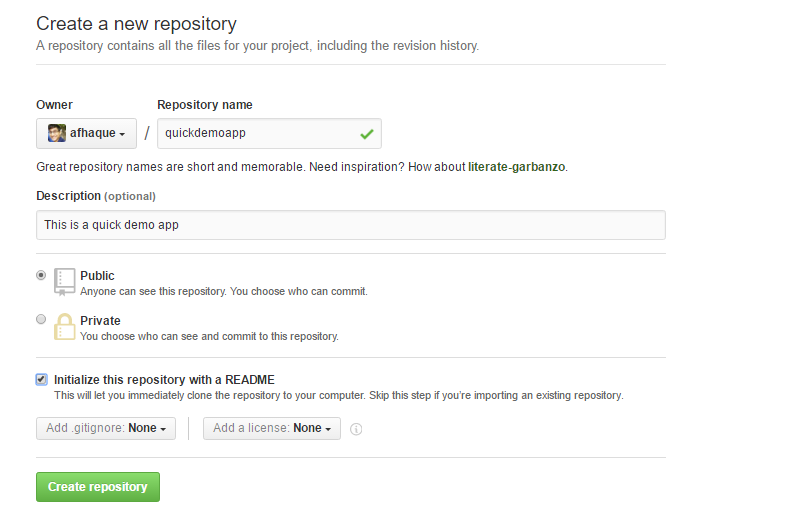

* Github Instructions
   
* Have the students follow along with the following steps:

  * Visit <https://github.com> and ask students to login to their personal accounts.

  * From the main page, create a new repository with an initialized `README.md` file. Explain that the convention in the software world is for each repository to have a "README" file that explains what the repository contains.

    

  * Make the repository public so TAs can have access to it for grading.

  * Click on the "Add .gitignore" and type "Python".

    

  * Click the green "Create repository" box. After clicking "Create repository", you’ll now be on the "homepage" of your repository.

    * The purpose of the "gitignore" file that you added to the repository is to ensure that files not tracked by GitHub remain untracked.

    * Click on the `.gitignore` file on your repository to open it.

      

    * In the `.gitignore` file you can see many different files by extension and distribution packages that won’t be tracked for this repository.

      

    * If you don’t want GitHub to track a file you can edit the `.gitignore` file by adding the file name or file extension.

    * Let's untrack a common file, `.DS_Store` for this repository. The `.DS_Store` file is created and maintained by the macOS Finder application in every folder, and has functions similar to the file `desktop.ini` in Microsoft Windows. We don't see this file in our folders.

      * Click on the pencil icon in the `.gitignore` file to edit the file.
      * Once in edit mode, add the following to the `.gitignore` above the `# Distribution / packaging` section.

      ```python
      # .DS_Store
      .DS_Store
      ```

      * Scroll to the bottom and enter the commit message. "Updating .gitignore file." where it says "Commit changes".
      * Click the green "Commit changes" button.

      

  * Switch back to computer's Desktop and create a new empty Excel file and save it. This will be used to demonstrate how to upload new files.

  * Navigate back to your repository homepage you created and click **Upload files**.

    

  * Choose your Excel file in the dialog box; instead of the "Upload Files" button, you may also drag files from your desktop to the GitHub web page for a repo. Add a commit message and commit the changes.

  * Finally, refresh the web page to show that the new file is now safely saved to the repository.

    
